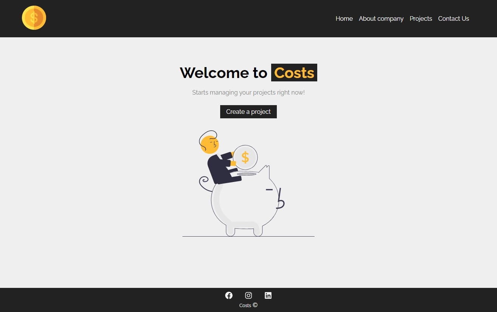

# Costs :moneybag:

This project was bootstrapped with [Create React App](https://github.com/facebook/create-react-app).

A simple CRUD solution proposed from a [React course](https://youtube.com/playlist?list=PLnDvRpP8BneyVA0SZ2okm-QBojomniQVO) review.

The ***Costs*** project is a website where the idea is to plan and manage your projects in the best way to control your costs. Here you can add the project information, like the total budget and related services.

## Available Scripts :page_facing_up:

In the project directory, you can run:

#### `npm start` 

It will run the app in development mode.  Open [http://localhost:3000](http://localhost:3000) to view it in your browser. 

#### `npm run backend`

Runs the backend. Open [http://localhost:5000/projects](http://localhost:5000/projects) to view the existing projects (*you can open db.json file*).

#### `npm test`

Launches the test runner in the interactive watch mode and will show the coverage. 

The tests were created using react [@testing-library](https://testing-library.com/docs/).

*Still in progress* :hammer:

## Screenshots :camera:

